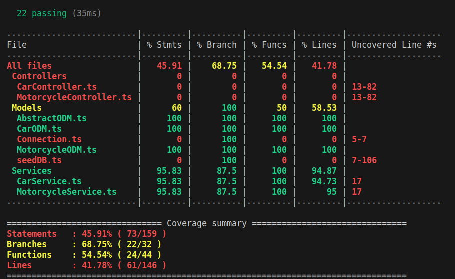

<h1 align="center">Boas-vindas ao repositório do Car Shop!</h1>

<h2 align="center">
  <a href="https://car-shop.up.railway.app/doc" target="_blank">
    Swagger
  </a>
</h2>
<br/>

## Objetivo

O <strong>Car Shop</strong> é uma API de gerenciamento de concessionárias que permite o gerenciamento de veículos, incluindo criação, leitura, atualização e exclusão. Foi utilizada a programação orientada a objetos para a construção dessa API.

## O que foi desenvolvido?

O Car Shop é uma API projetada para gerenciar uma concessionária de veículos, com estruturas de dados distintas para carros e motos. O Docker foi usado para criar dois containers: um para o Node, responsável por executar o JavaScript fora do navegador, e outro para o banco de dados MongoDB.

A linguagem utilizada para escrever a aplicação é o TypeScript, que é uma linguagem de tipagem estática. O Express.js gerencia as rotas, processa as requisições HTTP e define middlewares. A organização das pastas segue o modelo MSC (Model, Service, e Controller), aplicando princípios da programação orientada a objetos.

O ODM Mongoose foi utilizado para modelar e manipular o banco de dados, e os endpoints da API permitem realizar as operações CRUD (Criar, Ler, Atualizar e Excluir). Para a implementação dos testes de unidade, foram usadas as bibliotecas Mocha, Chai e Sinon, com desenvolvimento orientado a testes (TDD), resultando em uma cobertura de aproximadamente 85% da camada Service.

## Linguagens e ferramentas:
- Docker
- Node.js
- Typescript
- Express.js
- MongoDB
- Mongoose
- Mocha
- Chai
- Sinon

## Instalação e execução com Docker:

### 1 - Clone o repositório:
```
git clone git@github.com:h3zord/car-shop.git
```

### 2 - Entre no repositório:
```
cd car-shop
```

### 3 - Inicie os containers:
```
docker compose up -d
```

<strong>O container vai executar o node na porta 3000 e o banco de dados na porta 27017.</strong>
<br/>
➜ http://localhost:3000/

<br/>

## Endpoints

### - Cars
#### Método post:
- /cars ➜ Cria um novo carro.

#### Método get:
- /cars ➜ Lista todos os carros.
- /cars/:id ➜ Busca um carro pelo seu ID.

#### Método put:
- /cars/:id ➜ Atualiza um carro buscando pelo seu ID.

#### Método delete:
- /cars/:id ➜ Deleta um carro buscando pelo seu ID.

### - Motorcycles
#### Método post:
- /motorcycles ➜ Cria um nova moto.

#### Método get:
- /motorcycles ➜ Lista todas as motos.
- /motorcycles/:id ➜ Busca uma moto pelo seu ID.

#### Método put:
- /motorcycles/:id ➜ Atualiza uma moto buscando pelo seu ID.

#### Método delete:
- /motorcycles/:id ➜ Deleta uma moto buscando pelo seu ID.

<br/>

## Execução dos testes

### 1 - Entre no container do node:
```
docker exec -it car_shop sh
```
### 2 - Rode o script:
```
npm run test:coverage
```

<h2 align="center">Cobertura de testes</h2>
<br />

<div align="center">
  
</div>
<br />